# Cencus 1994 USA dataset
Prediction task is to determine whether a person makes over 50K a year.<br />
To perform this task we use CRISP-DM methodology. 
<br />
1. Business Ungerstanding:<br /><br />
    Company that offers service for people with medium to high level salaries. In this case, the cost of offer is 100$. When customer accepted offer we give 250$. So, we need to buld an algorithm that able to predict with accuracy from seventy to ninety percent. And these accuracy will allow us to make a profit.<br />
    <br />
    Profit/Costs:
    - Cost per offer 100$
    - Return per accepted offer 250$
    <br /><br />
2. Data Understanding:<br /><br />
    The dataset used in this project has forty nine thousand records and a binomial label indicating a salary. The data has been divided into a training dataset containing thirty two thousand records and a test dataset containing sixteen thousand records. The data has been divided into a training dataset containing thirty two thousand records and a test dataset containing sixteen thousand records.<br /><br />
    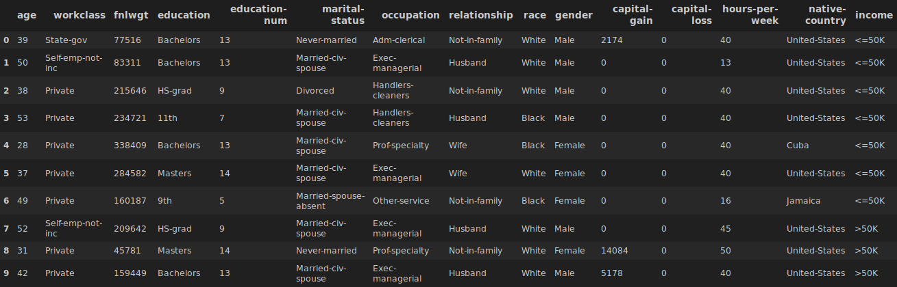<br />
    <br />
    Dataset consist of 15 attributes, which:
    - 6 continuous (age, final weight, education-number, capital-gain, capital-loss, hours-per-week)
    - 7 polinomials (workclass, education, marital-status, occupation, relationship, race, native-country)
    - 1 binomial (gender)<br /><br />
    Exploring continuous attributes:<br /><br />
    <br />
    <br />
    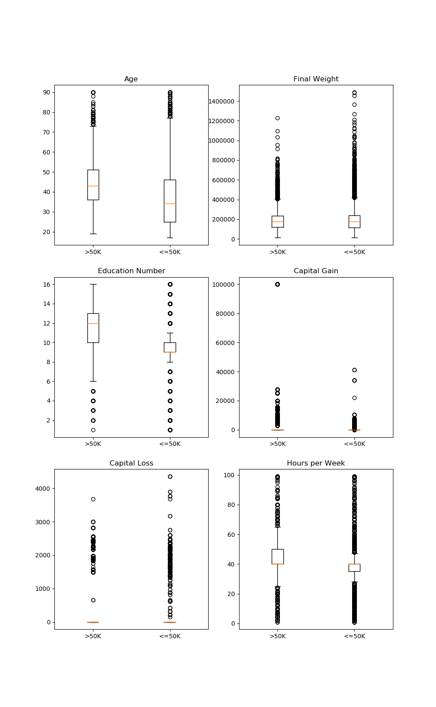<br />
    <br />
    The numeric attributes appear to contain a significant quantity of unique values (like fnlwgt) and in the case of the survey weight attribute there were twenty one thousand unique values out of thirty one thousand instances, which may suggest that this attribute may not be significantly predictive. So we will remove this attribute from dataset.<br />
    Exploring polinamials attributes:<br /><br />
    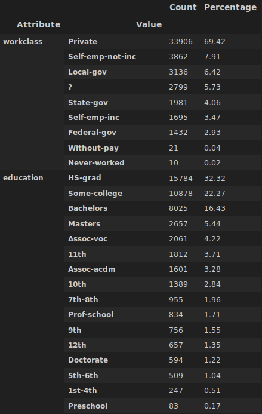<br />
    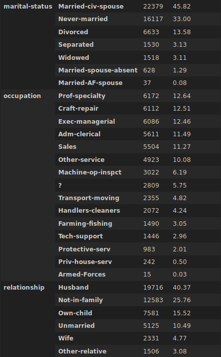<br />
    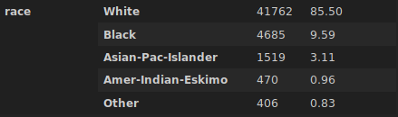<br />
    <br />
    Exploring binomial attributes:<br /><br />
    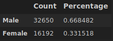<br />
    <br />
    Also, a slight bias was detected in the dataset where instances with a 'female' gender value have lower range of age values than instances with a 'male' gender value. <br />
    The numeric education number and nominal education level attributes were found to be fully correlated and therefore one of these attributes may be a good candidate for removal during modelling:<br /><br />
    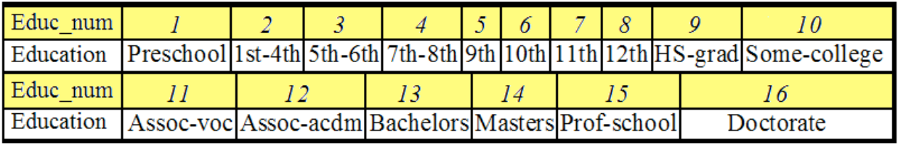<br />
    <br />
    In general the other attributes were found to be weakly correlated:<br /><br />
    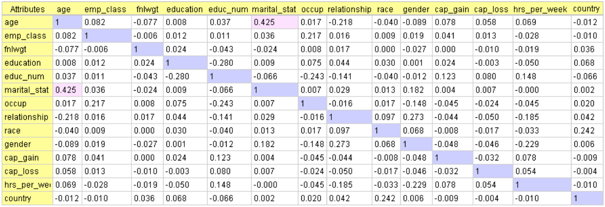<br />
    <br />
3. Data Preparation:<br /><br />
    Accuracy on unmodified data: <br /><br />
    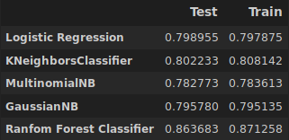<br />
    <br />
    During initial modelling on the training dataset with Linear Classifier it was found that removing the country (which has the same value in ninety percent of cases), education number (which is correlated with education level), survey weight (which is highly variate) and marital status (which appears to contain similar information to the relationship attribute as outlined earlier) attributes did not affect the model's performance.<br />
    Accuracy after removing features: <br /><br />
    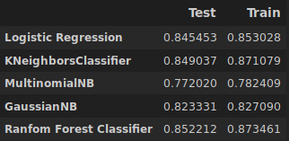<br />
    <br />
    By iteratively testing various bin boundary combinations an optimal bin quantity for ```age``` and ```hours per week``` was found
    Accuracy after binning data:<br /><br />
    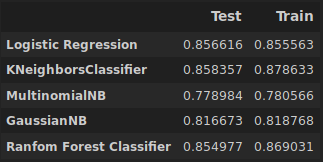<br />
    <br />
    Here we removed some not informative features (```marital status```, ```occupation```, ```gender```).<br />
    Accuracy after second modification of data:<br /><br />
    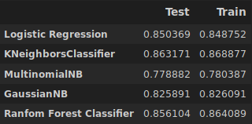<br /> 
    <br />
4. Modelling:<br /><br />
    Dataset has mixed numerical and nominal attributes with a binomial class label a Logistic Regression, K Neighbors Classifier, Multinomial Naive Base, Gaussian Naive Base, Random Forests Classifier had been selected for initial modelling. The best results showed Random Forest Classifier on dataset with removing features ```'native-country'```, ```'fnlwgt'```, ```'marital-status'```:<br /><br />
    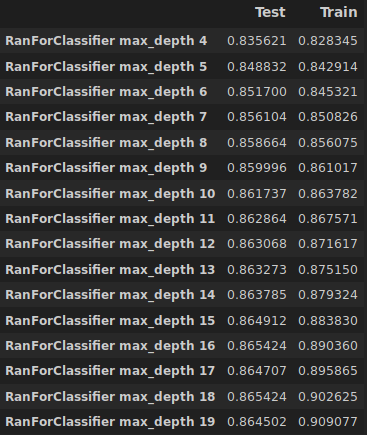<br />
    <br />
    Also we gave good result from K Neighbours Classifier on dataset. Although kNN had performed well on the unmodified dataset (see above) it was decided (as per the CRISP-DM framework) to return to the data preparation stage and apply the data transformations outlined above to kNN. The second step was the selection of an optimal value for k which was found to be six based on the classifier's accuracy on a sample of the training dataset. The first step was transform data, remove features ```'native-country'```, ```'fnlwgt'```, ```'marital-status'``` and binning ```'age'``` and ```'hours per week'```.<br /><br />
    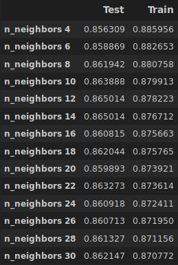<br />
    <br />
    The best results for Logistic Regression showed on binning dataset:<br /><br />
    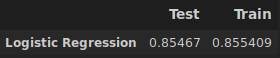<br />
    <br />
    The three best performing classifiers found during the modelling phase (Random Forests, K Neighbours Classifier, Logistic Regression) were then evaluated on the test dataset with the appropriate data transformations as outlined above. It was found that Random Forests had the best overall performance. Logistic Regression had the lowest runtime. The final result:<br /><br />
    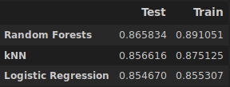<br />
    <br />
5. Evaluation:<br /><br />
    As an example of the calculations used to generate the return on investment and profitability charts we will work through the figures for the first bin quantities found with the Random Forests model.<br />
    <br />
    Number of prospects in bin = 1438<br />
    Predicted number of salaries > 50K = 1034<br />
    Predicted number of acceptances = 1034 * 0.75 = 776<br />
    (seventy five percent of individuals with salaries exceeding fifty housand dollars are expected to accept the current offer strategy)<br />
    <br />
    Setup Cost = 10000$ <br />
    Total Cost = setup cost + total cost of offers sent <br />
               = 10000 + (847 * 100) = 113400<br />
    <br />
    Total Revenue = number of acceptances * revenue per acceptance <br />
                  = 776 * 250 = 194000<br />
    <br />
    Profit = Total Revenue - Total Cost<br />
    = 194000 - 113400 = 80600<br />
    <br />

### Files
- jupyter notebook file with data visualization in jupyter folder
- data folder includes train and test datasets
- data_preprocess.py has methods for transformation datasets
- kneighbours.py has predicting function for kNN, log_reg.py and rndforests.py consist logistic regression and random forests computation respectively

### Version 3
Added features:
- Using CRISP-DM methodology for data analysis
- Three classifiers for predicting
- Notebook file with data visualization
- New trasforming for dataset in order increase performance

### Version 2
Logistic Regression for predicting.<br />
<br />
Used features: ```['age', 'workclass', 'education', 'relationship', 'race', 'gender', 'hours-per-week', 'occupation', 'native-country', 'marital-status', 'income']```<br /><br />
Added features in version 2:
- Added ```adult.test``` to computation
- Preprocessing and algorithms for computation in different files<br /><br />

Results:
- ```Train score: 0.8366```
- ```Test score: 0.8361```

### Version 1
We use Logistic Regression to predict. We use data from ```adult.test``` without ```adult.test```<br />
<br />
Features:
- One-Hot-Encoding categorial variables
- Splitting dataset using ```train_test_split()``` function
- Used features: ```['age', 'workclass', 'education', 'gender', 'hours-per-week', 'occupation', 'income']```<br />

Results:
- ```Train score: 0.8138```
- ```Test score: 0.8087```
