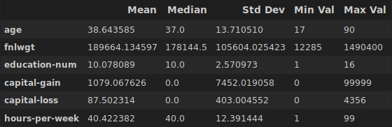

# Cencus 1994 USA dataset
Prediction task is to determine whether a person makes over 50K a year.<br />
Reference to dataset: [archive.ics.uci.edu](https://archive.ics.uci.edu/ml/datasets/adult)<br />
To perform this task we use CRISP-DM methodology. The CRISP-DM model is shown bellow:<br />
<br />
<br />
1. Business Ungerstanding:<br /><br />
    Company that offers service for people with medium to high level salaries. In this case, the cost of offer is 100$. When customer accepted offer we give 250$. So, we need to buld an algorithm that able to predict with accuracy from seventy to ninety percent. And these accuracy will allow us to make a profit.<br />
    <br />
    Profit/Costs:
    - Cost per offer 100$
    - Return per accepted offer 250$
    <br /><br />
2. Data Understanding:<br /><br />
    The dataset used in this project has forty nine thousand records and a binomial label indicating a salary. The data has been divided into a training dataset containing thirty two thousand records and a test dataset containing sixteen thousand records. The data has been divided into a training dataset containing thirty two thousand records and a test dataset containing sixteen thousand records.<br /><br />
    <br />
    <br />
    Dataset consist of 15 attributes, which:
    - 6 continuous (age, final weight, education-number, capital-gain, capital-loss, hours-per-week)
    - 7 polinomials (workclass, education, marital-status, occupation, relationship, race, native-country)
    - 1 binomial (gender)<br /><br />
    Exploring continuous attributes:<br /><br />
    <br />
    <br />
    Exploring polinamials attributes:<br /><br />
    <br />
    <br />
    <br />
    <br />
    Exploring binomial attributes:<br /><br />
    <br />


### Version 2
Logistic Regression for predicting.<br />
<br />
Used features: ```['age', 'workclass', 'education', 'relationship', 'race', 'gender', 'hours-per-week', 'occupation', 'native-country', 'marital-status', 'income']```<br /><br />
Added features in version 2:
- Added ```adult.test``` to computation
- Preprocessing and algorithms for computation in different files<br /><br />

Results:
- ```Train score: 0.8366```
- ```Test score: 0.8361```

### Version 1
We use Logistic Regression to predict. We use data from ```adult.test``` without ```adult.test```<br />
<br />
Features:
- One-Hot-Encoding categorial variables
- Splitting dataset using ```train_test_split()``` function
- Used features: ```['age', 'workclass', 'education', 'gender', 'hours-per-week', 'occupation', 'income']```<br />

Results:
- ```Train score: 0.8138```
- ```Test score: 0.8087```
